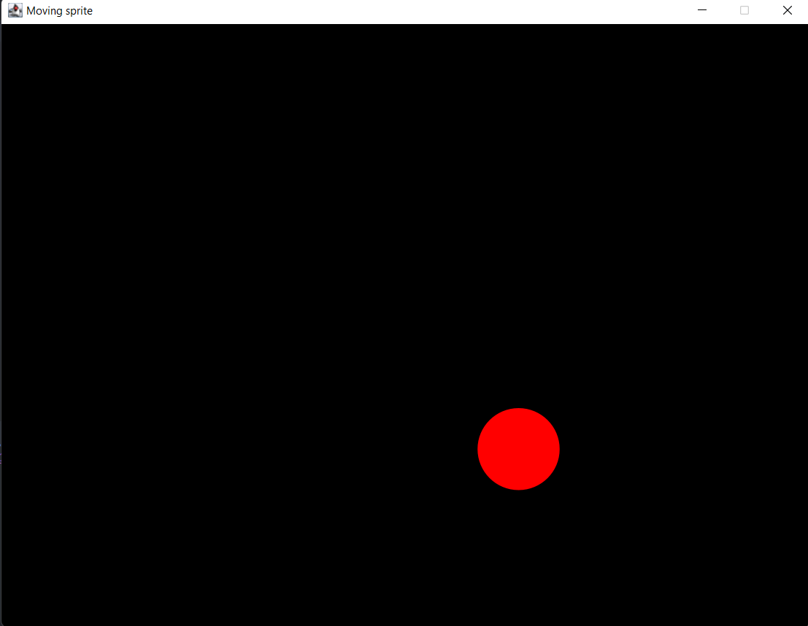

### İstediğimiz boyutta oluşturduğumuz çerçevede ekranın tam ortasında bir top oluşturuyoruz ve ekranda hareket etmesini sağlıyoruz bunu yaparken çerçeveden çıkmamasını sağlıyoruz.
### Hareket eden bu topun klavyenin *yukarı ok* tuşuna basıldığında büyümesini, *aşağı ok* yönüne basıldığında küçülmesini aynı şekilde *sağ ok* tuşuna basıldığında hızlanmasını, *sol ok* tuşuna basıldığında yavaşlanması sağlanmıştır.

