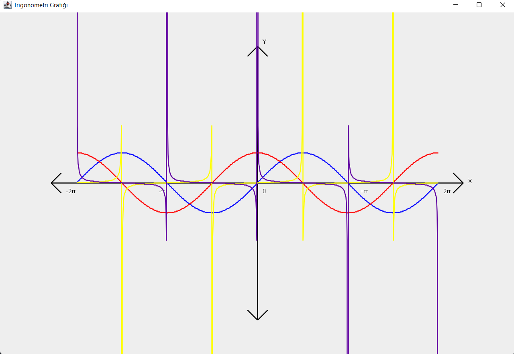
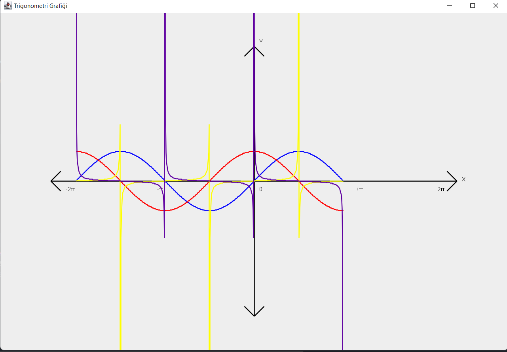
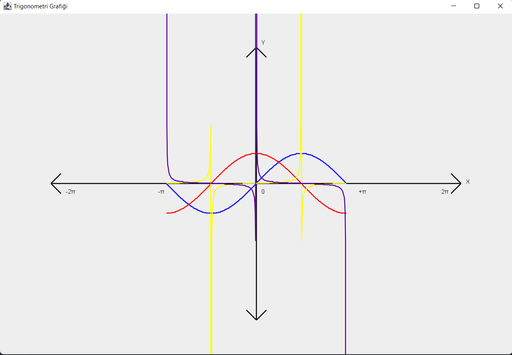

## Sin-Cos-Tan-Cot Grafiklerinin Çizdirilmesi
### Sin ve Cos genlikleri alınıyor ve min 10 olacak şekilde kontrol sağlanıyor.
### Dereceleri de kullanıcıdan alıyoruz en az -360 en fazla +360 şekilde çiziyoruz.
### -360 dereceden +360 dereceye olan grafiğimiz

### -360 dereceden +180 dereceye olan grafiğimiz

### -180 dereceden +180 dereceye olan grafiğimiz
